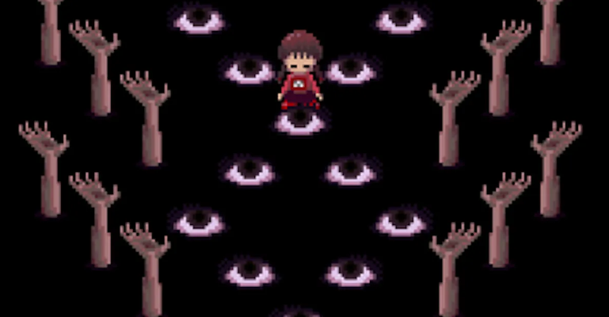
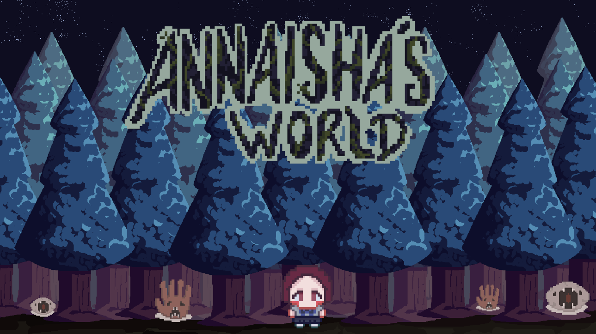
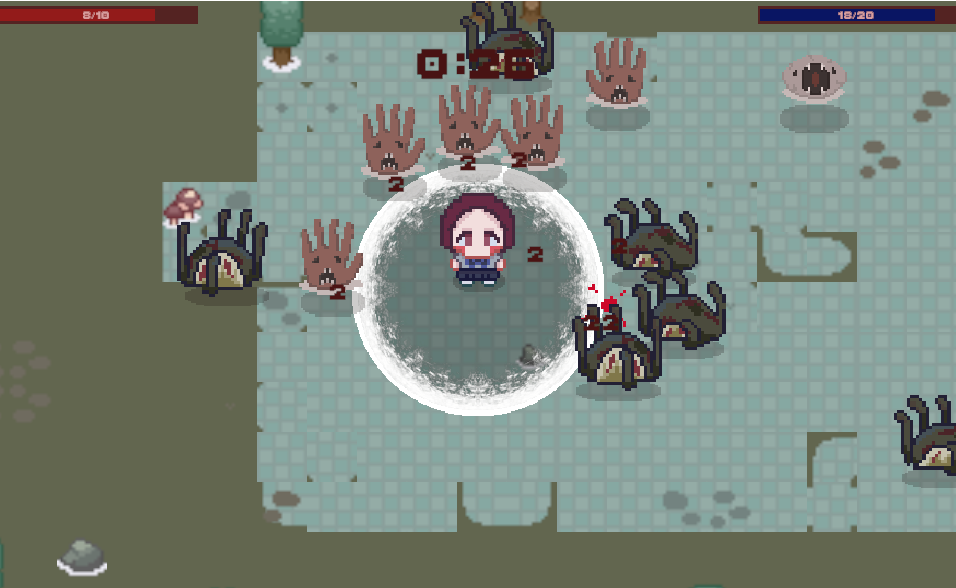
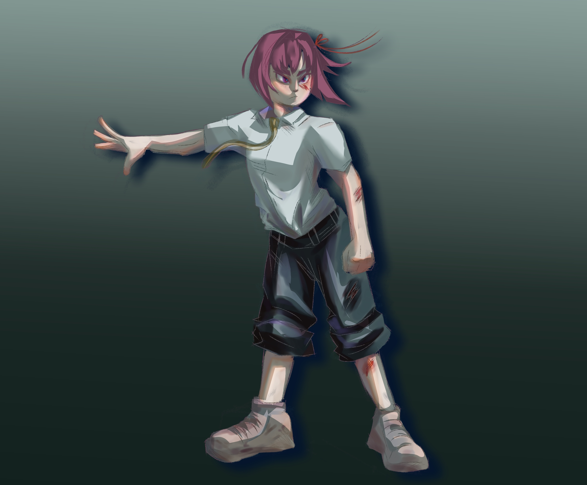
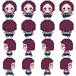

# ANNAISHA'S WORLD :smiling_imp: :evergreen_tree: :evergreen_tree:

**DESARROLLADORES**

Karime Monserrat Castro Macedo
Belén Guadalupe Maldonado González
Estefanya López Pérez
David Emmanuel Rico de la Rosa

## TABLA DE EVALUACIÓN DEL EQUIPO :ledger:

| Nombre        |   Colaboración    |   Comunicación   |   Responsabilidad |
|--|--|--|--|
| David         |      Buena        |     Regular      |      Buena        |
| Belén         |      Buena        |     Buena        |      Buena        |
| Estefanya     |      Buena        |     Buena        |      Buena        |
| Karime        |      Buena        |     Regular      |      Buena        |

## 1. PROPÓSITO DEL JUEGO :video_game: 

### 1.1 Resumen del juego

Es un juego RGP survival y terror que consta de un nivel con un personaje (principal) y enemigos (antagonista), donde la protagonista tiene que enfrentar diversos enemigos donde su única herramienta es su aura espiritual con lo que ocupará como poder especial.  El único es el bosque donde tendrá que pelear con los enemigos que le acerquen. La dificultad será moderada. El visual del juego será pixel art (8 bit) estilo anime. La clasificación del juego será para mayores de 12 años (B). Está inspirado en el juego japonés de aventura surrealista yume nikki.

### 1.2 Resumen de la historia del juego 

Annaisha es una que se encuentra perdida en un bosque pero en otro mundo donde, por lo que va a través del camino  se encuentra con unos monstruos que le impiden el paso e intentarán robar su aura. 

1.3 Resumen de la historia del juego

* RGP
* 1 personaje y diversos enemigos
* estilo anime en pixel art
* survival y terror
* clasificación B
* 3 escenarios
* dificultad media
* Ataques especiales

## 2\. Jugabilidad :joystick:

El juego será creado para PC y sus controles son el teclado

Teclas de movimiento
* Arriba (W o ↑)
* Abajo (S o ↓)
* Izquierda (A o ←)
* Derecha (D o →)
* Pausa (Esc o P)

3\. Mundo del juego
-Bosque

## 4\. Mecánicas del juego :chess_pawn:

*Movimiento:* El personaje puede moverse de un lado a otro.
*Combate:* Con las mismas teclas de movimiento.
*Recolección de recursos:* Recoge experiencia cuando mata enemigos para poder aumentar las mejores de su aura (impacto, rango y tamaño)

*Sistema de salud:* Sólo cuenta con 10 vidas para sobrevivir y 1 segundo de inmunidad.

*Objetivo:* Luchar contra los enemigos y evitar ser robada de su aura.

## 5\. Personajes :raising_hand_woman:

Personaje 1
- Nombre: Annaisha (anni chan)
- Propósito: Sobrevivir a los enemigos
- Arquetipo: Héroe

## 6. Plan del proyecto :scroll:

1era entrega - readme (historia del juego, personajes, monstruos y escenarios, portabilidad del juego) *30 de mayo*

2da entrega - diseños finales de personajes y escenarios  *15 de junio*

3era entrega - estructura del juego visualmente  *5 de julio*

4ta entrega - beta del juego *25 de julio*

5ta entrega- entrega final  *11 de agosto*

